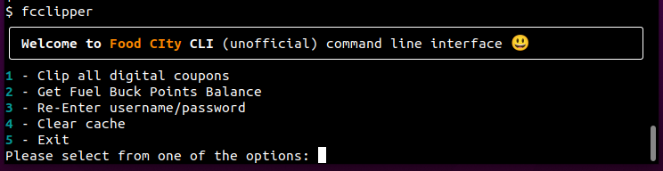

# fcclipper 
**fcclipper** is an automatic digital coupon clipper for grocery store chain "Food City".  

- Execution can be scheduled for convience. 
- Current point balances can also be retrieved.
### Usage
A command line interface (CLI) interface is accessible via:
```console
$ fcclipper
```



Commands also execute directly through options:
```shell
$ fcclipper clip-coupons
```
This allows ```fcclipper``` to be scheduled to run on your OS.

A help section is available with the ```--help``` option for all commands:

```console
$ fcclipper --help
Usage: fcclipper [OPTIONS] COMMAND [ARGS]...

  This program is the unoficial CLI for FoodCity - check Fuel Buck Balance
  and clip digital coupons

Options:
  --disable-headless  Display browser.
  -d, --debug         Debug output is logged.
  --version           Show the version and exit.
  --help              Show this message and exit.

Commands:
  clear-cache     Clear cached items.
  clip-coupons    Clip all digital coupons.
  get-fuel-bucks  Get Fuel Buck Points Balance.
  
```
```console
$ fcclipper clip-coupons --help
Usage: fcclipper clip-coupons [OPTIONS]

  Clip all digital coupons.

Options:
  --dry-run  No Coupons are clipped.
  --help     Show this message and exit.
```
### Installation
Python 3.8+ is required to run. If running windows OS use the [Official Python Download](https://www.python.org/downloads/) site to install python.

The fcclipper code can be downloaded via:
```shell
git clone https://github.com/jadunn1/fcclipper.git
```

A virtual environment is not required, but can be set up following the [python venv site](https://docs.python.org/3/library/venv.html)  documentation.

Install fcclipper via:

```console
pip install .
```
or if preferred
```console
python setup.py install
```

The first execution of ```fcclipper``` will prompt for Food City account credentials.